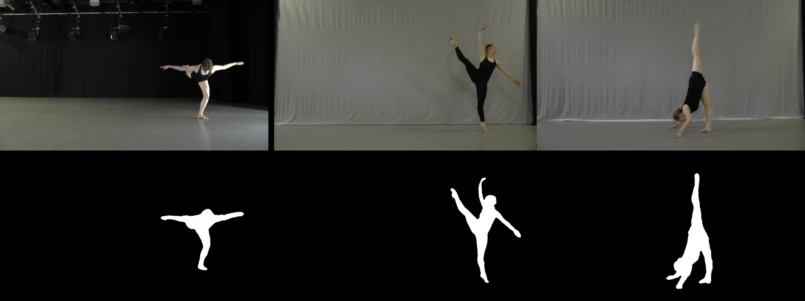
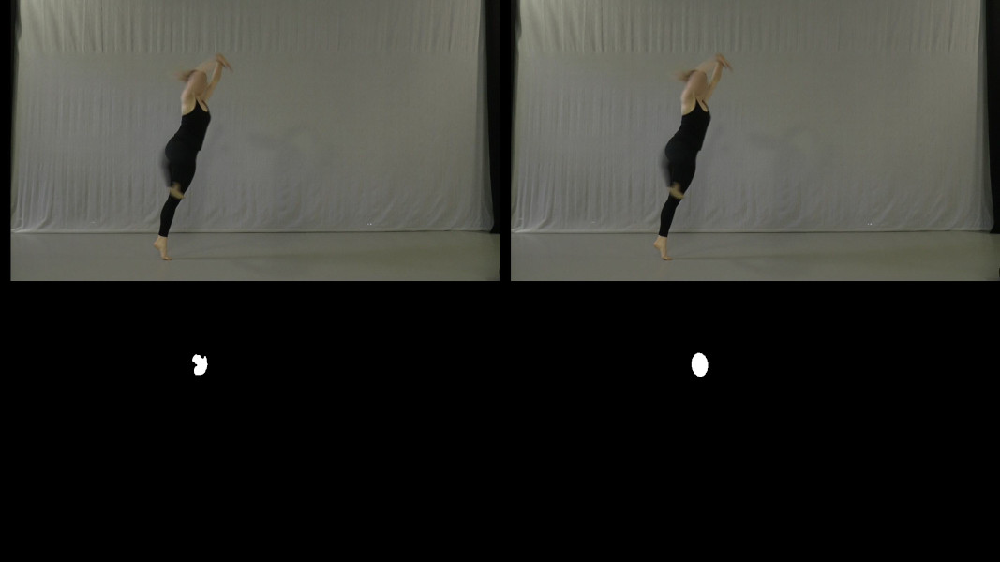
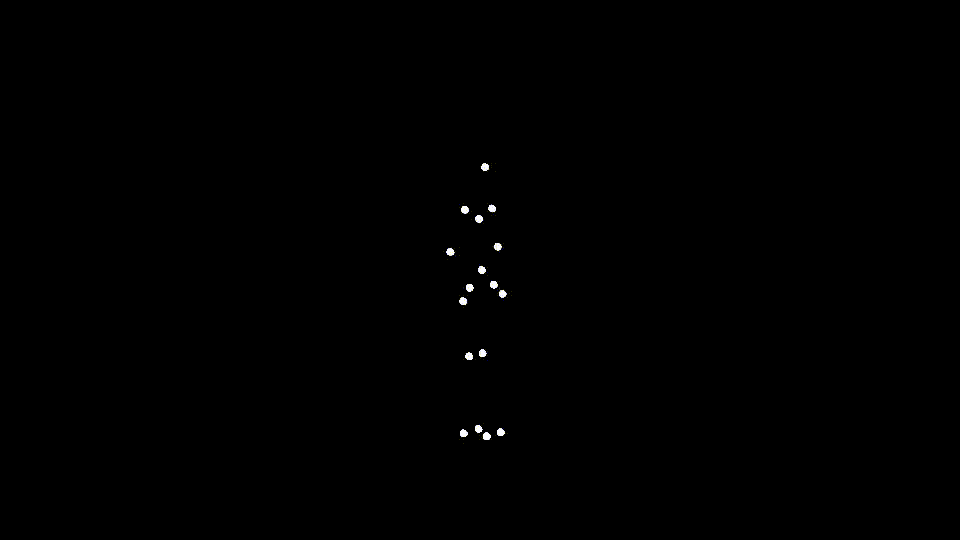
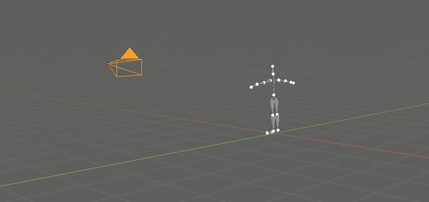
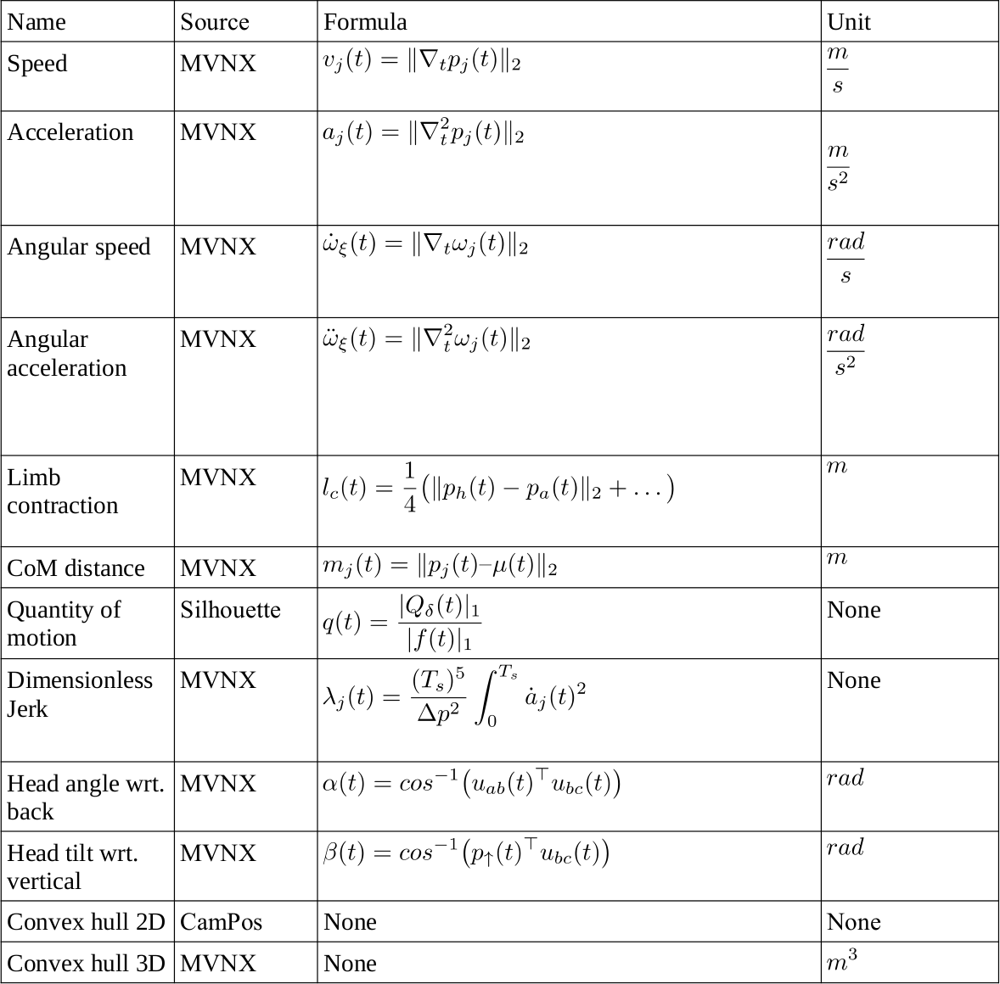
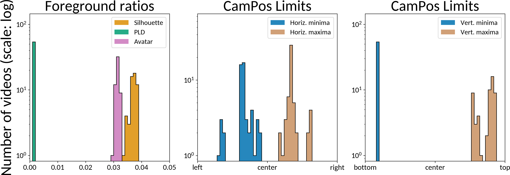
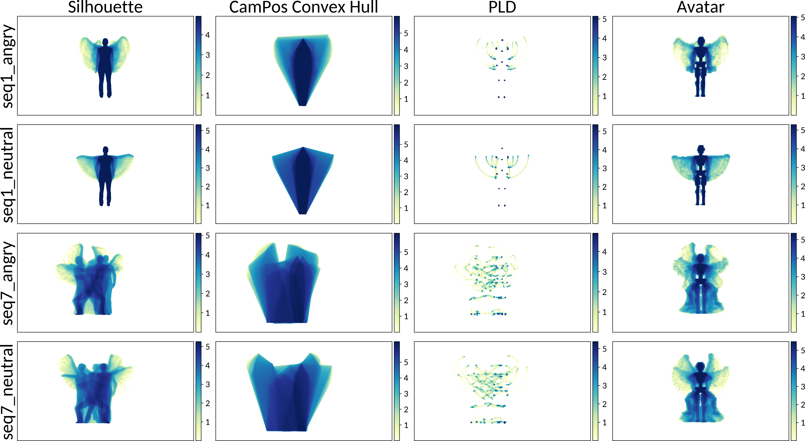
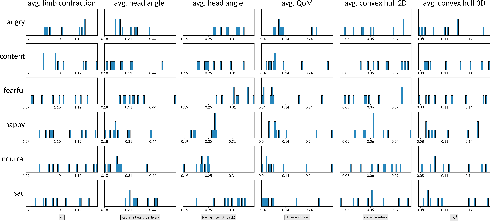

# EMOKINE


[](https://doi.org/10.5281/zenodo.7821844)

This repository was developed for the curation of the [EmokineDataset](https://zenodo.org/record/7821844) pilot dataset, but it can be used to curate further datasets of similar characteristics. If you use our work, please consider citing us!

```
@misc{emokine,
      title={{EMOKINE}: A Software Package and Computational Framework for Scaling Up the Creation of Highly Controlled Emotional Full-Body Movement Datasets,
      author="Christensen, Julia F. and Fernandez, Andres and Smith, Rebecca and Michalareas, Georgios and Yazdi, Sina H. N. and Farahi, Fahima and Schmidt, Eva-Madeleine and Bahmanian, Nasimeh and Roig, Gemma",
      year={2024},
}
```

The rest of this document provides instructions to reproduce the following actions:

1. Getting the `EmokineDataset` (optional).
2. Installing the dependencies to run the `emokine` Python library on Ubuntu (which provides the functionality listed here, and was used to generate the `EmokineDataset`).
3. Converting MoCap data from [MVNX](https://base.xsens.com/s/article/MVNX-Version-4-File-Structure?language=en_US) (as provided by the XSENS system) into CSV.
4. Extracting black-and-white silhouettes from dancer videos.
5. Extracting (detailed or elliptical) face-masks from dancer images, and optionally applying a blur.
6. Computing the kinematic features present in the `EmokineDataset`.
7. Reproducing the `technical validation` statistics from our paper (optional).


Note that we use the `EmokineDataset` as basis for illustration and reproducibility purposes: Researchers interested in applying this software to data from other systems can do so with little to no adaptions (see explanation below in this README). Our code is released under an open source [LICENSE](LICENSE), and can be adapted, extended and applied to further data. Any feedback and contributions are welcome!


Here are visual examples of the rendering capabilities of the library, and below are the installation and usage instructions.






-------------------------------------------------------------------------------
# Software Installation:

Instructions tested on Ubuntu 20.04, Python 3.9 and Blender 3.4, but should work with other configurations too.

### Python dependencies

```
# create, activate  and configure environment
conda create -n emokine python==3.9
conda activate emokine
conda install -n base conda-libmamba-solver
conda config --set solver libmamba

# deep learning-related dependencies
conda install -c conda-forge av
python -m pip install detectron2 -f https://dl.fbaipublicfiles.com/detectron2/wheels/cu113/torch1.10/index.html
conda install pytorch==1.10.1 torchvision==0.11.2 torchaudio==0.10.1 cudatoolkit=11.3 -c pytorch -c conda-forge
conda install -c conda-forge python-wget
conda install -c anaconda scikit-image
pip install git+https://github.com/andres-fr/face_segmentation_pytorch.git

# dependencies for general processing and analysis
conda install -c conda-forge omegaconf
conda install -c anaconda pandas
conda install -c conda-forge matplotlib
conda install -c anaconda seaborn
conda install -c conda-forge pytz
conda install -c anaconda pillow
conda install -c anaconda lxml
conda install -c conda-forge shapely
conda install -c conda-forge libstdcxx-ng
```

A comprehensive description of a working environment can be seen [here](assets/requirements.txt)

### Setting up Blender with our MVNX add-on:

This is needed if we have XSENS MoCap data in the form of `.mvnx` files and we want to project their 3D positions onto a given camera perspectiven and e.g. generate PLD stimuli (the black background with white dots). The following picture gives an intuition of the process:



1.  Install Blender following instructions at https://www.blender.org/ (e.g. `sudo snap install blender --classic`).
2. Install our [Blender MVNX add-on](assets/blender_addon/io_anim_mvnx.zip) by running `blender`, going to `Edit->Preferences->Add-Ons->Install` and selecting the `./assets/blender_addon/io_anim_mvnx.zip` file.
3. Install dependencies as explained [here](https://blender.stackexchange.com/a/140343/70695) (commands for Ubuntu below).

```
# First find BPYTHON, the path to Blender's python executable. On 3.4, can be found as follows
BPYTHON=`blender -b --python-expr "import sys; print(sys.executable)" | grep "/python/bin/python"`

# Then install and update pip
$BPYTHON -m ensurepip
$BPYTHON -m pip install --upgrade pip

# Install the dependencies
$BPYTHON -m pip install pytz
$BPYTHON -m pip install lxml
```


-------------------------------------------------------------------------------
# The `EmokineDataset`

> :point_right: The pilot dataset can be downloaded from [here](https://zenodo.org/record/7821844).

`EmokineDataset` features a single dancer performing 63 short sequences, which have been recorded and analyzed in different ways. This pilot dataset is organized in 3 folders:
* `Stimuli`: The sequences are presented in 4 visual presentations that can be used as stimulus in observer experiments:
  1. `Silhouette`: Videos with a white silhouette of the dancer on black background.
  2. `FLD` (Full-Light Display): video recordings with the performer's face blurred out.
  3. `PLD` (Point-Light Display): videos featuring a black background with white circles corresponding to the selected body landmarks.
  4. `Avatar`: Videos produced by the `XSENS` motion capture propietary software, featuring a robot-like avatar performing the captured movements on a light blue background.
* `Data`: In order to facilitate computation and analysis of the stimuli, this pilot dataset also includes several data formats:
  1. `MVNX`: Raw motion capture data directly recorded from the XSENS motion capture system.
  2. `CSV`: Translation of a subset of the `MVNX` sequences into `CSV`, included for easier integration with mainstream analysis software tools). The subset includes the following features: `acceleration`, `angularAcceleration`, `angularVelocity`, `centerOfMass`, `footContacts`, `orientation`, `position` and `velocity`.
  3. `CamPos`: While the MVNX provides 3D positions with respect to a global frame of reference, the `CamPos` [JSON](https://www.json.org/json-en.html) files represent the `position` from the perspective of the camera used to render the `PLD` videos. Specifically, their 3D positions are given with respect to the camera as `(x, y, z)`, where `(x, y)` go from `(0, 0)` (left, bottom) to `(1, 1)` (right, top), and `z` is the distance between the camera and the point in meters. It can be useful to get a 2-dimensional projection of the dancer position (simply ignore `z`).
  4. `Kinematic`: Analysis of a selection of relevant kinematic features, using information from `MVNX`, `Silhouette` and `CamPos`, provided in tabular form.
* `Validation`: Data and experiments reported in our paper as part of the pilot dataset validation, to support its meaningfulness and usefulness for downstream tasks.
  1. `TechVal`: A collection of plots presenting relevant statistics of the pilot dataset.
  2. `ObserverExperiment`: Results in tabular form of an online study conducted with human participants, tasked to recognize emotions of the stimuli and rate their beauty.

More specifically, the 63 unique sequences are divided into 9 unique choreographies, each one being performed once as an explanation, and then 6 times with different intended emotions (angry, content, fearful, joy, neutral and sad). Once downloaded, the pilot dataset should have the following structure:

```
EmokineDataset
├── Stimuli
│   ├── Avatar
│   ├── FLD
│   ├── PLD
│   └── Silhouette
├── Data
│   ├── CamPos
│   ├── CSV
│   ├── Kinematic
│   ├── MVNX
│   └── TechVal
└── Validation
    ├── TechVal
    └── ObserverExperiment
```

Where each `<MODALITY>` of the stimuli, `MVNX`,  `CamPos` and `Kinematic` have this structure:

```
<MODALITY>
├── explanation
│   ├── <MODALITY>_seq1_explanation.<EXTENSION>
│   ├── ...
│   └── <MODALITY>_seq9_explanation.<EXTENSION>
├── <MODALITY>_seq1_angry.<EXTENSION>
├── <MODALITY>_seq1_content.<EXTENSION>
├── <MODALITY>_seq1_fearful.<EXTENSION>
├── <MODALITY>_seq1_joy.<EXTENSION>
├── <MODALITY>_seq1_neutral.<EXTENSION>
├── <MODALITY>_seq1_sad.<EXTENSION>
...
└── <MODALITY>_seq9_sad.<EXTENSION>
```

The `CSV` directory is slightly different, because instead of a single file for each `seq` and `emotion`, it features a folder containing a `.csv` file for each one of the 8 features being extracted (acceleration, velocity...). We refer readers to our paper for more details on the data and companion software.


-------------------------------------------------------------------------------
# Using the `emokine` software

> :point_right: Although the [`EmokineDataset`](https://zenodo.org/record/7821844) pilot dataset was recorded via the XSENS system, most of the software provided here can be directly applied to data obtained from other motion capture systems with little to no modification. Specifically, only the files `1a_mvsn_to_csv.py` and `1b_mvnx_blender.py` are relevant to the MVNX formatted data. This data is then converted to tabular format (see e.g. [positionExample.csv](assets/positionExample.csv)), which is then consumed by the remaining scripts (together with plain video data whenever needed). Researchers intending to use this software with MoCap data from other systems simply need to ensure that their MoCap data follows the same tabular format, and that they have video data available whenever needed (e.g. for silhouette extraction).

In this section we showcase the relevant `emokine` functionality, by running the software on the `EmokineDataset`. The purpose of each script, as well sa its input parameters that can be consulted as follows:

```
python -c "x = __import__('1a_mvnx_to_csv'); print(x.__doc__); print(x.ConfDef.__doc__)"
blender -b --python-use-system-env --python 1b_mvnx_blender.py -- -h
python -c "x = __import__('2a_silhouettes'); print(x.__doc__); print(x.ConfDef.__doc__)"
python -c "x = __import__('2b_face_blurs'); print(x.__doc__); print(x.ConfDef.__doc__)"
python -c "x = __import__('3a_kinematic_features'); print(x.__doc__); print(x.ConfDef.__doc__)"
python -c "x = __import__('4a_techval_compute'); print(x.__doc__); print(x.ConfDef.__doc__)"
python -c "x = __import__('4b_techval_plots'); print(x.__doc__); print(x.ConfDef.__doc__)"
```

Check also the source code for more documentation.


### Convert MVNX to CSV

The following command can be used to generate the `CSV` modality from the `MVNX` modality:

```
for mvnx in EmokineDataset/Data/MVNX/*.mvnx; do python 1a_mvnx_to_csv.py MVNX_PATH=$mvnx OUT_DIR=output/$(basename ${mvnx})/csv; done
```

### Use Blender to extract camera positions and rendering of PLDs

The following command generates the `CamPos` modality from the `MVNX` modality:

```
for mvnx in EmokineDataset/Data/MVNX/*.mvnx; do blender -b --python-use-system-env --python 1b_mvnx_blender.py -- -x $mvnx -o "output/"$(basename ${mvnx})"/blender_out"; done
```

To additionally render the `PLD` modality as a set of images, add the `-r` flag as follows:

```
for mvnx in EmokineDataset/Data/MVNX/*.mvnx; do blender -b --python-use-system-env --python 1b_mvnx_blender.py -- -x $mvnx -o output/$(basename ${mvnx})/blender_out -r; done
```

And to render it as video, add the `-v` flag:

```
for mvnx in EmokineDataset/Data/MVNX/*.mvnx; do blender -b --python-use-system-env --python 1b_mvnx_blender.py -- -x $mvnx -o output/$(basename ${mvnx})/blender_out -r -v; done
```

### Automated rendering of silhouettes and face blurs

First, the video that we want to process must be converted to a sequence of images, e.g. with the following command:

```
ffmpeg -i <INPUT_VIDEO> -vf yadif -filter:v scale=-1:800 -qscale:v 2 <OUT_FOLDER>/%05d.jpg
```

Note that to make computation faster in this example we are reducing the output to have a height of `800` pixels. THe `-qscale` parameter determines the output quality (the lower the better, best is 1).


Then, we can extract the silhouettes as follows (given a directory with images, results will be stored in that same directory):


```
python 2a_silhouettes.py MIN_IDX=0 SKIP_N=3 MEDIAN_FILT_SIZE=5 INCLUDE_DL_ABOVE=0.99 IMGS_DIR=<...>
python 2a_silhouettes.py MIN_IDX=1 SKIP_N=3 MEDIAN_FILT_SIZE=5 INCLUDE_DL_ABOVE=0.99 IMGS_DIR=<...>
python 2a_silhouettes.py MIN_IDX=2 SKIP_N=3 MEDIAN_FILT_SIZE=5 INCLUDE_DL_ABOVE=0.99 IMGS_DIR=<...>
```

Note that this can be a memory-hungry process, so in this example we skip one every 3 frames to reduce the size of the sequence, and then we start at indexes 0, 1 and 2 to compute the full sequence.

**Face mask extraction**:

```
python 2b_face_blurs.py IMGS_DIR=<...> PERSON_THRESHOLD=0.1 KP_THRESHOLD=0.3 FM_THRESHOLD=0.7 BBOX_SIZE=100
```

**Elliptic face mask extraction**:

```
python 2b_face_blurs.py IMGS_DIR=<...> PERSON_THRESHOLD=0.1 KP_THRESHOLD=0.3 FM_THRESHOLD=0.7 BBOX_SIZE=100 ELLIPTIC_MASK=1.1
```

**Face blur extraction**:

```
python 2b_face_blurs.py IMGS_DIR=<...> PERSON_THRESHOLD=0.1 KP_THRESHOLD=0.3 FM_THRESHOLD=0.7 BBOX_SIZE=100 GAUSS_BLUR_STD=8
```

**Elliptic face blur extraction**:

```
python 2b_face_blurs.py IMGS_DIR=<...> PERSON_THRESHOLD=0.1 KP_THRESHOLD=0.3 FM_THRESHOLD=0.7 BBOX_SIZE=100 ELLIPTIC_MASK=1.1 GAUSS_BLUR_STD=8
```


### Kinematic Feature Extraction

The means to extract kinematic features from a given sequence depend on the specific features and nature of the data. For example, if the data is in MVNX format, we already have the keypoint positions, whereas video data needs a keypoint estimation step. The following table summarizes the features being computed, and their corresponding modalities (more details in the paper):




To exemplify this computation, the following command uses the `3a_kinematic_features.py` script to generate the `Kinematic` modality from the `MVNX, Silhouette, CamPos` modalities in `EMOKINE`:

```
for mvnx in EmokineDataset/Data/MVNX/*.mvnx; do sil=${mvnx//Data\/MVNX\/MVNX/Stimuli\/Silhouette\/Silhouette}; sil=${sil/mvnx/mp4}; json=${mvnx//MVNX/CamPos}; json=${json/mvnx/json}; out=${mvnx//MVNX/Kinematic_rerun}; out=${out/mvnx/csv}; python 3a_kinematic_features.py MVNX_PATH=$mvnx SILHOUETTE_PATH=$sil JSON_PATH=$json CSV_OUTPATH=$out; done

# Optionally compute also the examples
for mvnx in EmokineDataset/Data/MVNX/explanation/*.mvnx; do sil=${mvnx//Data\/MVNX\/explanation\/MVNX/Stimuli\/Silhouette\/explanation\/Silhouette}; sil=${sil/mvnx/mp4}; json=${mvnx//MVNX/CamPos}; json=${json/mvnx/json}; out=${mvnx//MVNX/Kinematic_rerun}; out=${out/mvnx/csv}; python 3a_kinematic_features.py MVNX_PATH=$mvnx SILHOUETTE_PATH=$sil JSON_PATH=$json CSV_OUTPATH=$out; done
```


### Technical validation


The following 2 commands compute and plot the technical validation data, respectively. The first command can take around 20 minutes and generates the `techval.pickle` file (around 3.6GB), and the second command generates the plots from `techval.pickle`:

```
python 4a_techval_compute.py EMOKINE_PATH=EmokineDataset OUTPUT_DIR=output NUM_PROCESSES=8
python 4b_techval_plots.py TECHVAL_PICKLE_PATH=output/techval.pickle OUTPUT_DIR=output/
```

The following command was used to post-process the images (trimming borders). Note that `mogrify` is the in-place version of `imagemagick`, which must be installed in the system for this to work:

```
for i in output/*.png; do mogrify -trim $i; done
```

The results are the technical validation images included in our paper, and also as the `TechVal`supplement in the `EmokineDataset`. Here is an example of the output:






